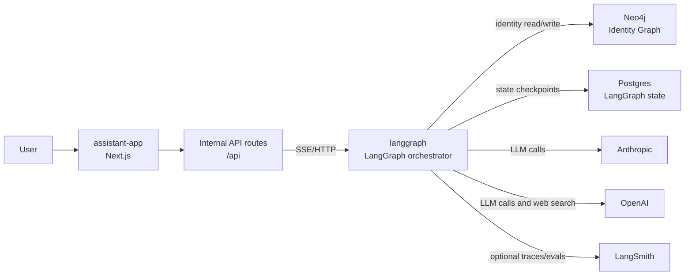
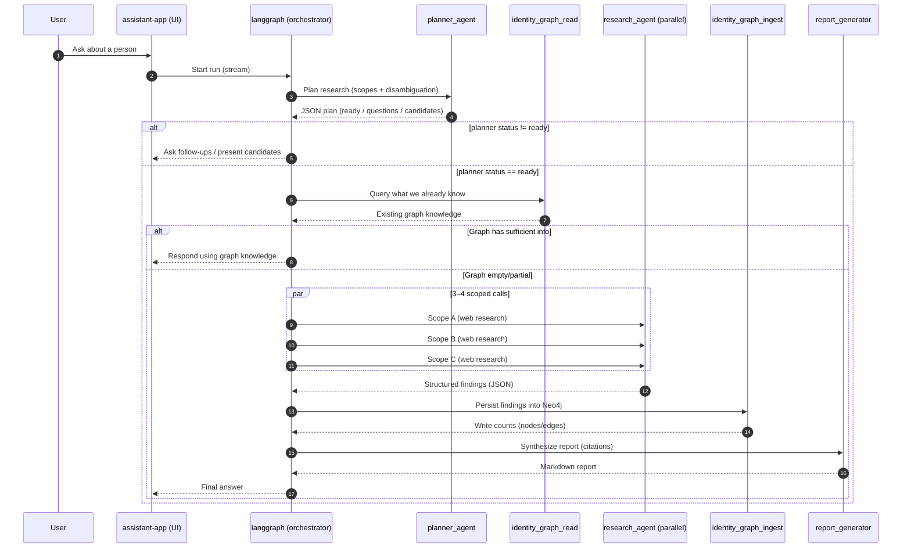
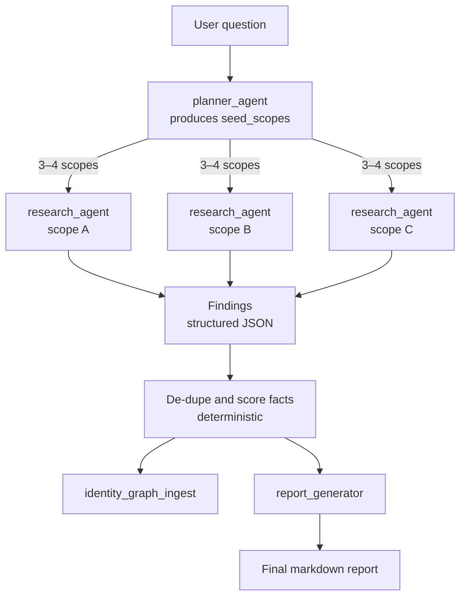

# ELILEAI Deep Research Agent (Demo)

This repo contains a **deep research agent** created for **ELILEAI** as a demo/take-home style project. It’s a small multi-agent system that:

- **Plans** a research approach for a person (disambiguation + scoped sub-queries)
- **Checks an identity graph** (Neo4j) to avoid redundant web research
- **Runs parallel web research sub-agents** and collects structured findings
- **Persists the results** back into the identity graph
- **Generates a citation-heavy report** as the final response

The monorepo is an **Nx TypeScript workspace** with:
- `apps/assistant-app`: Next.js UI + internal API routes
- `apps/langgraph`: LangGraph backend (orchestrator + tools)
- `packages/*`: shared libraries (logger, test utilities)

## Quickstart

### Prerequisites
- Node.js 20+
- Docker (for Postgres + Neo4j)

### First-time setup

```bash
cp .env.example .env
# fill in secrets in .env

npm run setup
```

### Run it locally

```bash
npm run dev
```

- **UI**: `http://localhost:3000`
- **LangGraph API** (default): `http://localhost:2024`
- **Neo4j Browser** (default): `http://localhost:7474`

## Common commands

```bash
npm run dev            # start all dev servers
npm run build          # build all projects
npm run test           # run all tests
npm run lint           # lint all projects
npm run infra:up       # start docker services (postgres + neo4j)
npm run infra:down     # stop docker services
```

Targeted tests:

```bash
npx nx run assistant-app:test
npx nx run langgraph:test:unit
npx nx run langgraph:test:int
```

## Architecture (at a glance)

### System overview



### Deep research flow (planner → graph → sub-agents → report)



### Search strategy (parallel scopes → consolidation)



## More details
- **Architecture docs**:
  - `docs/architecture/overview.md`
  - `docs/architecture/agent-flow.md`
  - `docs/architecture/identity-graph.md`
- **Infrastructure notes**: `infrastructure/README.md`

## Repo structure

```
├── apps/
│   ├── langgraph/           # TypeScript backend (LangGraph)
│   └── assistant-app/       # Next.js frontend
├── packages/
│   ├── logger/              # Shared logger
│   └── shared-testing/      # Shared Vitest utilities
├── infrastructure/          # Docker Compose + init scripts
└── docs/                    # Architecture docs
```
