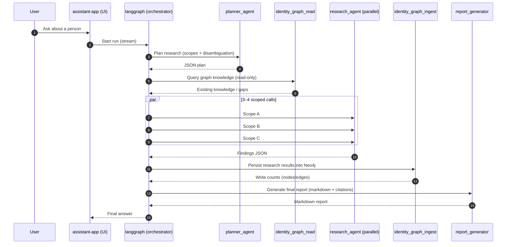
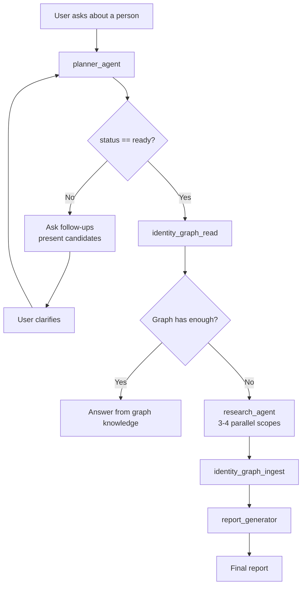

# Agent Flow

This document describes the end-to-end flow used by the `langgraph` orchestrator when performing deep research on a person.

## Sequence (happy path)

## Control-flow (ready vs follow-ups)

## Sub-agent search strategy

The orchestrator treats web research as expensive and fallible. The planner decomposes the task into **multiple distinct scopes** (e.g. identity confirmation, career, affiliations, adverse media), then the orchestrator runs those scopes in parallel. The final report is generated only after:

- facts have been consolidated and scored deterministically
- results have been persisted to the identity graph

This keeps the workflow reproducible and makes follow-up questions cheaper over time.

