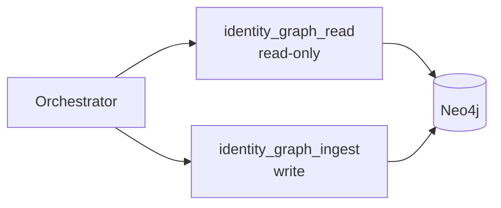

# Identity Graph (Neo4j)

The identity graph is the system’s memory for “what we already know about a person”. It supports:

- avoiding redundant web research
- enabling follow-up questions in the same thread
- making the agent’s knowledge inspectable outside the chat UI

## Tools

- **`identity_graph_read`**: read-only queries against Neo4j.
- **`identity_graph_ingest`**: persists research results into the graph after research completes.

## Read-only safety model

`identity_graph_read` is backed by a **read-only Neo4j user/role**. This is a deliberate guardrail: even if the model tries to mutate the graph, the DB role prevents writes.

See `infrastructure/README.md` for:
- Neo4j ports
- the init job that creates the read-only user
- default credentials for local development

## Flow integration

## Operational notes

- In local dev, Neo4j is started via `npm run infra:up` (Docker Compose).
- If you need to reset the graph, tear down volumes (`docker compose down -v`) and bring infra back up.

